# File purpose
This file contains description of how to set up source code stored in this folder in order to run application using **FRDM-KL27z** development board.

# Project setup
I used **MCUXpresso** software to start a project. I imported project with following steps. 
1. From *Quickstart panel*, choose *Import SDK Example*
2. Choose *frdmkl27z* board and click *Next*
3. Open `demo_apps` and select `power_mode_switch`
4. Click *Finish*
5. At this point, initial working example should be imported in your workspace
6. In left-top corner, choose *File* option
7. Click on *Import*
8. From local filesystem, import context-lib library: subfolders `include`, `platform\frdm_kl27z`, `src`,`ulog`
9. Right-click `context_lib` folder, click *Properties* and check *C/C++ Build*: *Exclude resource from build* option should **not** be ticked
10. Several drivers need to be added to build: Use Right-click project -> *SDK Management* -> *Manage SDK Components* to add every driver from *Necessary drivers* list. *(most of them will probably already be added)*

# Necessary drivers
1. `fsl_adc16.h`
2. `fsl_clock.h`
3. `fsl_common.h`
4. `fsl_gpio.h`
5. `fsl_i2c.h`
6. `fsl_llwu.h`
7. `fsl_lptmr.h`
8. `fsl_lpuart.h`
9. `fsl_pmc.h`
10. `fsl_port.h`
11. `fsl_rcm.h`
12. `fsl_smc.h`
13. `fsl_tpm.h`
14. `fsl_uart.h`

# Use case 1: connections
First app only uses on-board timer *TPM2* and therefore doesn't need any external connections

# Use case 2: connections
Second app makes use of external **KY-016 RGB LED module**. Module legs *R*,*G*,*B* needs to be connected to *PTC3*,*PTC5*,*PTC6* pins 
of the microcontroller, configured as GPIO outputs. It does not matter which leg will be connected to which pin. Leg marked as *-* has to be
connected to *GND*. 
**WARNING**: *KY-016* module does not contain internal resistors, so external ones (100Ω for Green, 100Ω for Blue and 180Ω for Red diode are 
recommended) has to be put between module legs and MCU ports. 
*For the connections, refer to frdm-kl27z pinout on sites like Mbed or Mouser*

# Use case 3: connections
By far the most complex connection makes use of 8 on-board pins, three external buttons, breadboard, potentiometer and EEPROM. 

Connect on-board pins as follows:
- *+3v3 voltage source* <-> *Plus line on breadboard*
- *GND* <-> *Minus line on breadboard*
- *A0/PTE16* <-> *Middle leg on potentiometer*
- *as for the other two potentiometer legs, connect one to ground and one to 3v3. You can use breadboard for that*
- *D15/PTD7* <-> *SCL* EEPROM pin
- *D14/PTD6* <-> *SDA* EEPROM pin
- *PTC5* <-> *normal line on breadboard*
- *PTC6* <-> *normal line on breadboard*
- *PTC4* <-> *normal line on breadboard*

Connect EEPROM pins as follows:
- *A0,A1,A2* <-> *GND*
- *Vss* <-> *GND*
- *Vcc* <-> *3v3*
- *WP* <-> *GND*
- *SCL* <-> *PTD7* frdm pin
- *SDA* <-> *PTD6* frdm pin

Connect *PTC5,PTC6,PTC4* pins as follows(reading input from button using pull-up resistor):
```
                PTx pin
        ____     ^      __
Vcc ---|____|----|-----(__)-----Gnd
        10KΩ          Button

```

## 24LC015 EEPROM Pinout
```
     ___________
A0 -|    |_|    |- Vcc
    |           |
A1 -|           |- WP
    |           |    
A2 -|           |-SCL
    |           |
Vss-|___________|-SDA

```

# Config tools
This project uses MCUXpresso config tools to take care of module initialization. Important settings can be seen on the pictures below. Note that
 most of these settings have not been changed in super significant ways and the one that requires most attention is by far pin config

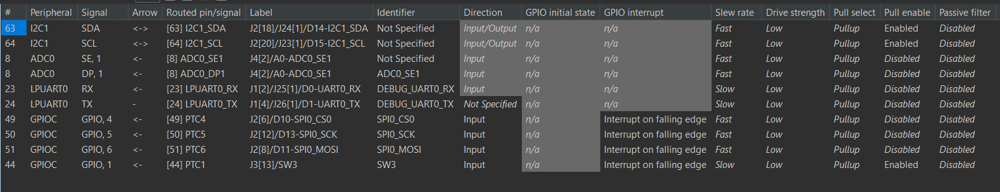
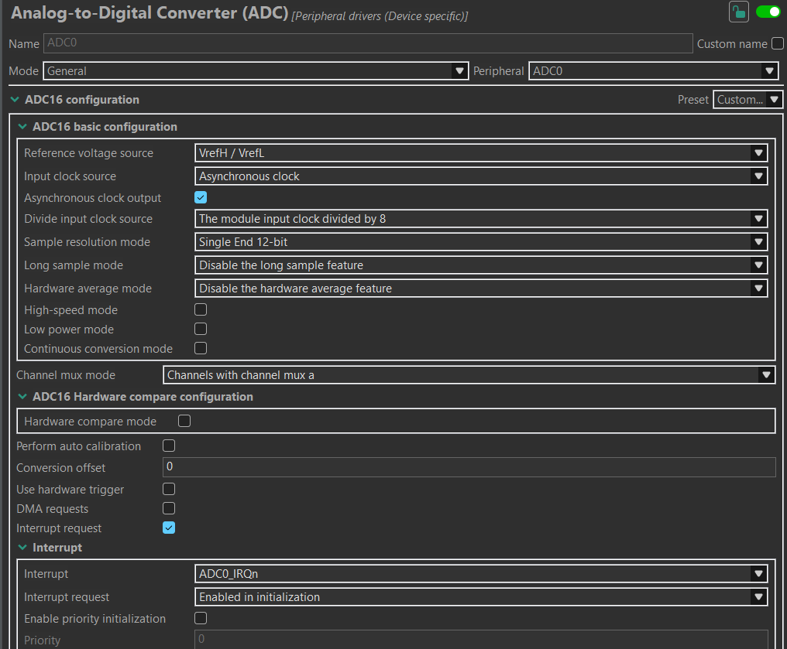
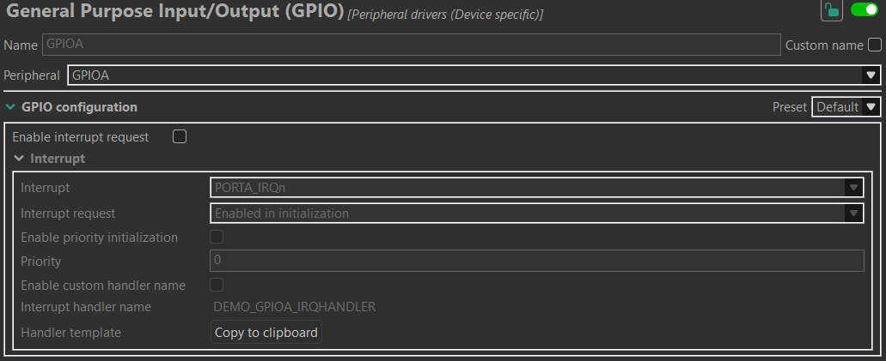
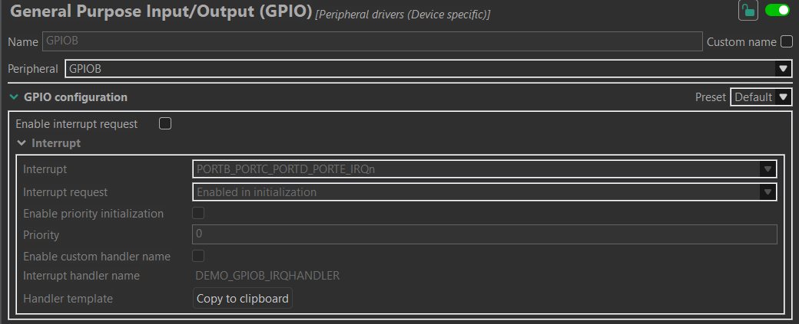
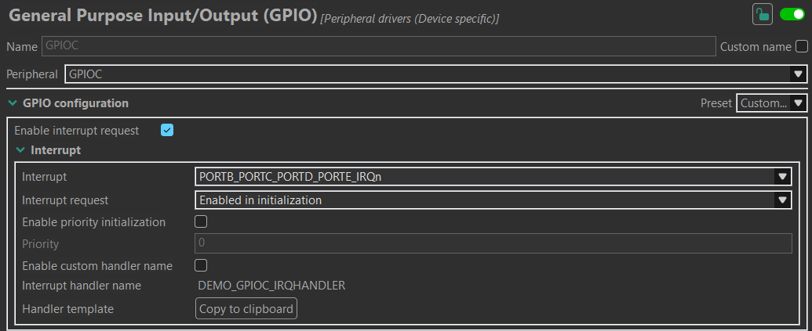
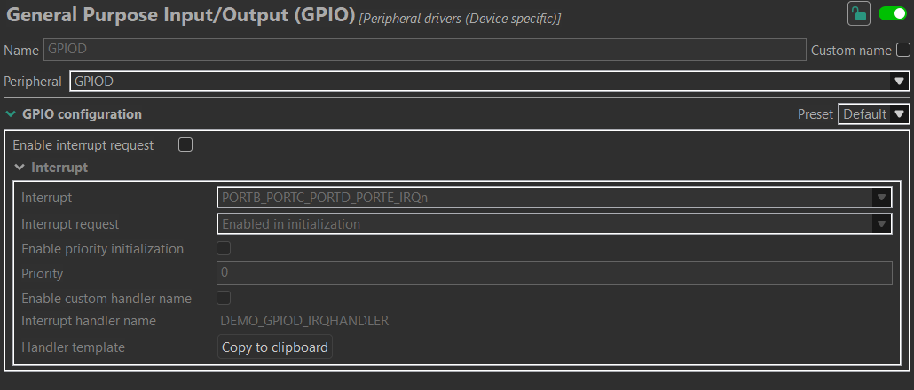
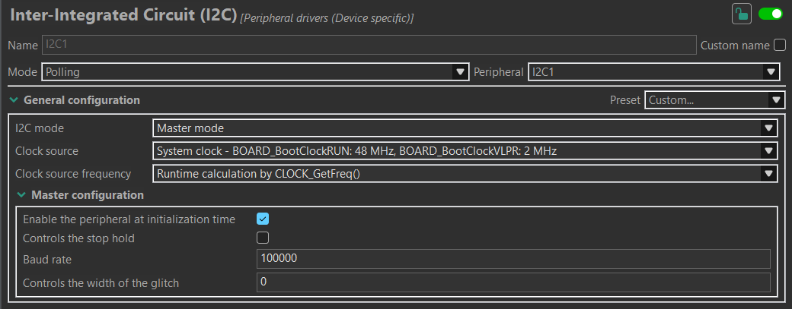
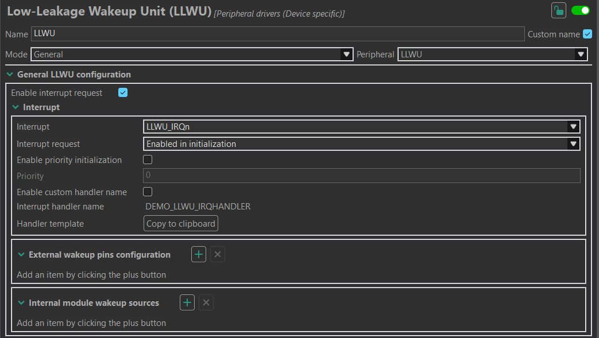
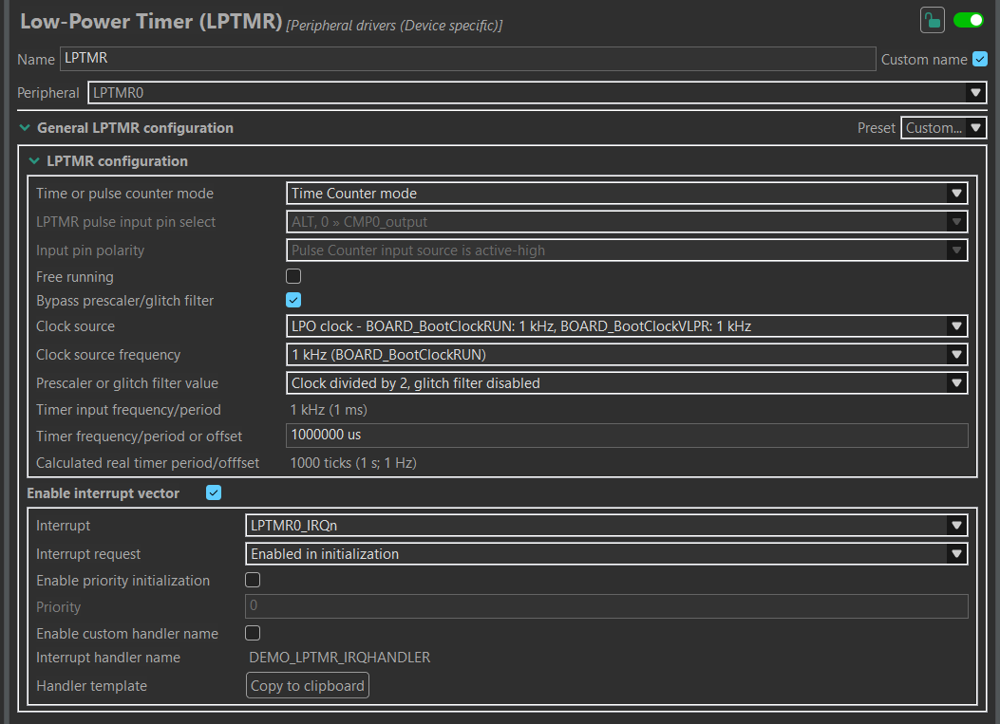
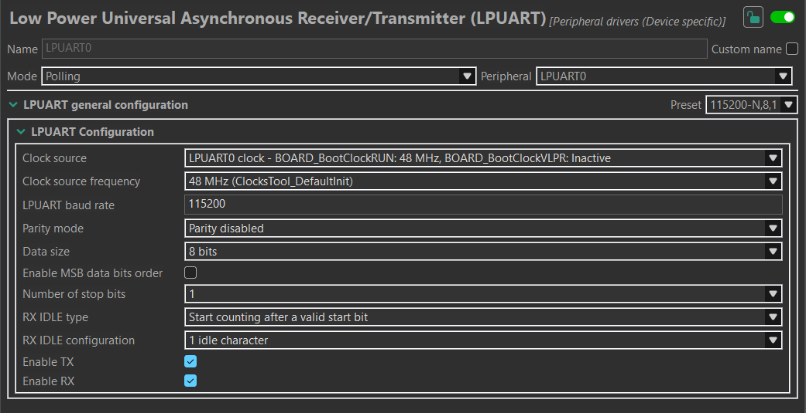
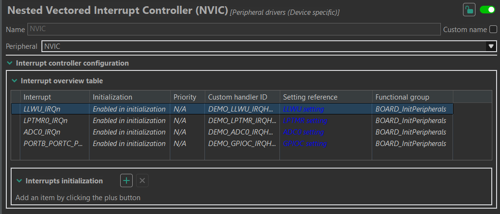